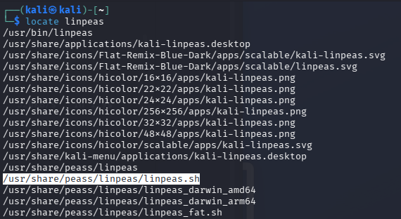
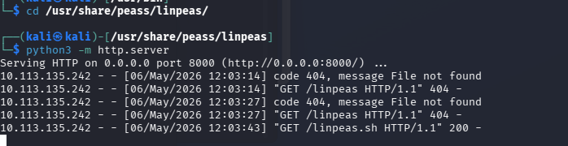
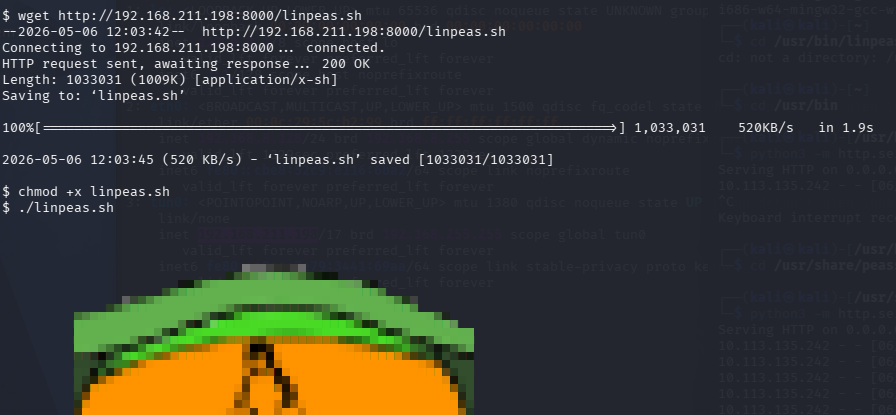
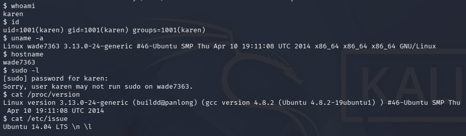

## 🔍 Enumeration

Enumeration is a critical phase in privilege escalation. It helps identify potential weaknesses in the system.

There are two main approaches:

### ⚙️ 1. Automated Enumeration

Automated tools help speed up the process and uncover common misconfigurations quickly.

#### 🛠 Popular Tools:

* **LinPeas**
* **LinEnum**
* **LES (Linux Exploit Suggester)**
* **Linux Smart Enumeration**
* **Linux Priv Checker**

> ✅ I preferred using **LinPeas** because it is frequently updated and very convenient to use.

* **LinPeas**

* **From My Machine :**
* **Find LinPeas tool in my kali**
* **make simple server to trasfer the LinPeas.sh to victim machine**




* **From Victim Machine :**
* **find directory i can write,read,and execute such as /tmp  **
* **get LinPeas.sh in victim machine by "wget" command**
* **show permssion of the recive file we will find it do not have executable aption**
* **change his permssion by "chmod" command**
* **run LinPeas.sh**


.png)


---

### 🧠 2. Manual Enumeration

Manual enumeration is essential to deeply understand the system and catch things automated tools might miss.

#### 📌 Useful Commands:

* `whoami` → Confirms the current user
* `id` → Shows user ID and group memberships
* `sudo -l` → Checks for commands that can be run as root
* `hostname` → Displays the system hostname

---

#### 🖥 System Information:

* `uname -a` → Reveals kernel version (useful for exploits)
* `cat /proc/version` → Shows kernel info and compiler details
* `cat /etc/issue` → Displays OS information (may be customized)

---

#### 👥 User Enumeration:

* `cat /etc/passwd` → Lists users on the system
* `history` → May reveal sensitive commands or credentials


---

#### 🌐 Network Information:

* `ifconfig` → Displays network interfaces and IP addresses

---

#### 🔎 File & Permission Hunting:

* `find` → Used to locate files with specific:

  * Permissions
  * Ownerships
  * Configurations

> ⚡ Example:

```bash
find / -perm -4000 2>/dev/null
```

(Search for SUID binaries)

---

## 🧠 Key Insight

> 🔥 Automated tools are fast, but manual enumeration is what makes the difference in real-world scenarios.
