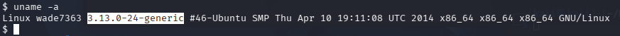
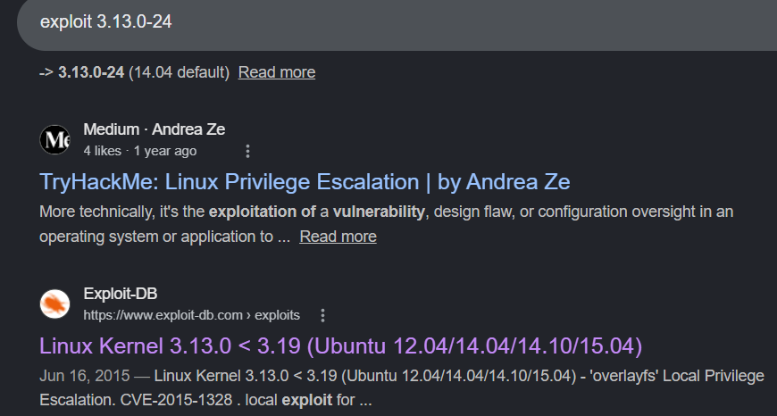
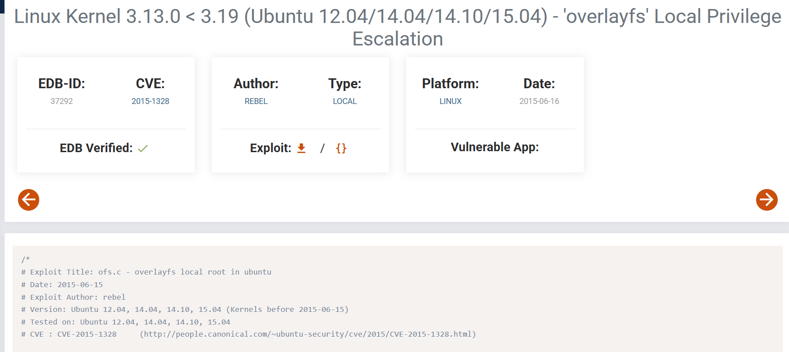
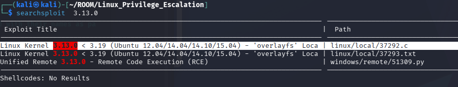
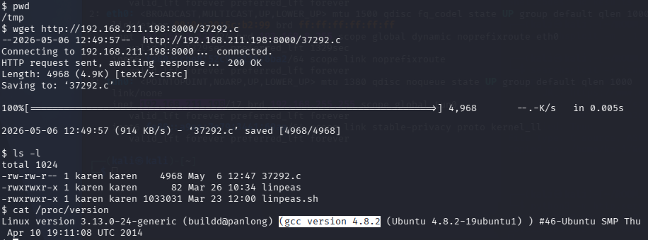
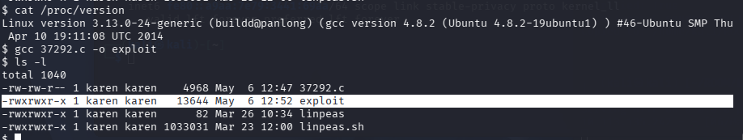
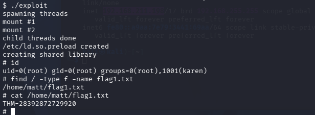

In Privilege Escalation : Kernel Exploit 
we search for kernel version and find the exploit code can use to get root privilege 

from victim machine : 

use command : uname -a OR cat /proc/version to the version and the compile installed in victim machine

from my machine : 

Then you have two approch to find the code :
                                             1-online public allocation 2-offline public allocation
Online by search by kernel version in google at Exploit-db :

you can copy this code or download and used it  

offline public allocation by search by kernel version using "searchsploit" :

install the exploit code and make simple server
.png)

from victim machine :

go to tmp directory
and get exploit code by "wget"

we want to execute this code but is can not. we can not use "chmod", but use compiler to execute this code by gcc compiler  

then run this file and get root privilege and find flag

