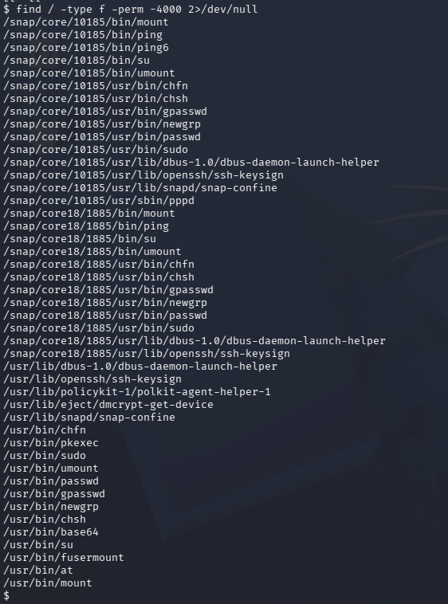
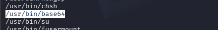
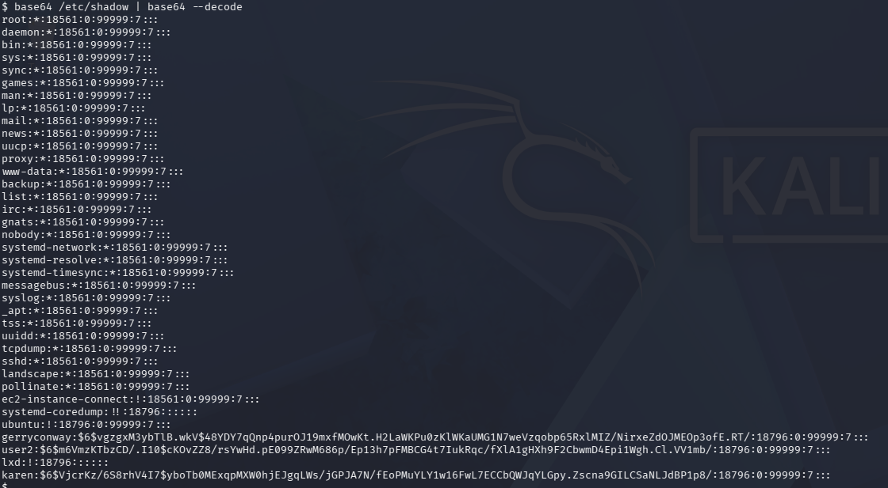
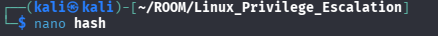
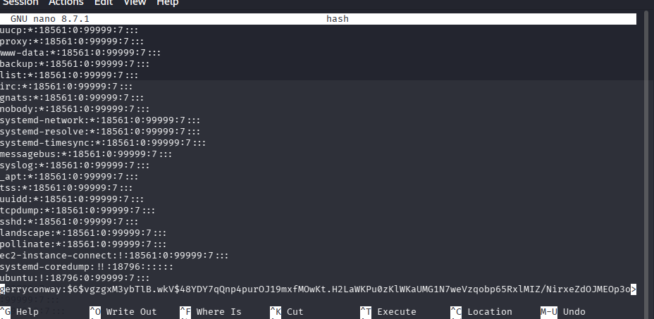
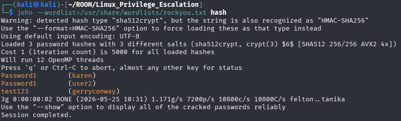
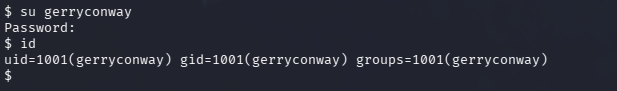
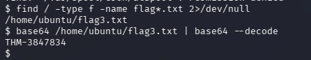

# 🔐 Privilege Escalation: SUID

you know that files can have read, write, and execute permissions. These are given to users within their privilege levels. This changes with SUID (Set-user Identification) and SGID (Set-group Identification). These allow files to be executed with the permission level of the file owner or the group owner

---

* **To find file with SUID permission you use this command :**

```bash
find / -type f -perm -4000 2>/dev/null
```


* **we find base64 as SUID in owner user "rws"**



* **will use this bin to read shadow file and get copy from it**



* **make file and copy this hash**




* **use john to undecription the hash of password**



* **Now you can switch user**
```bash
su gerryconway
```



* **find flag and read it by base64**




